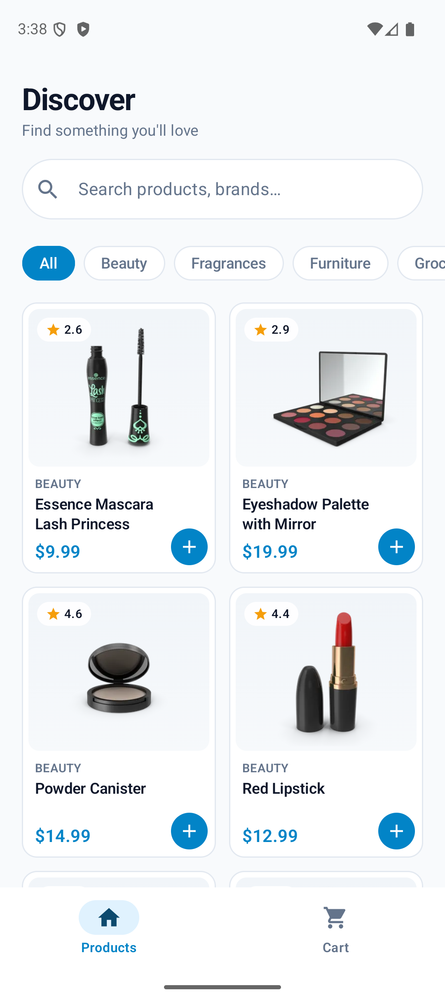
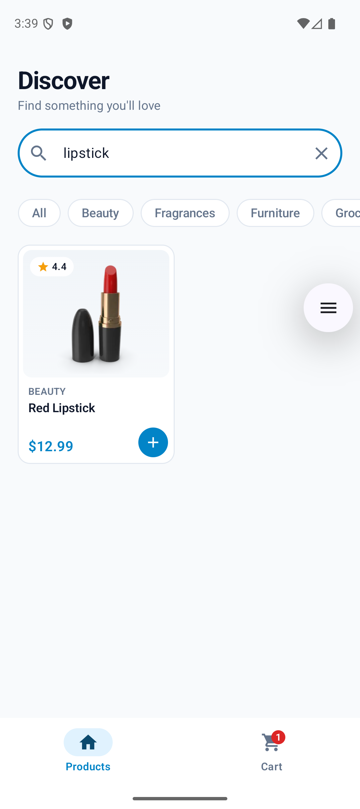
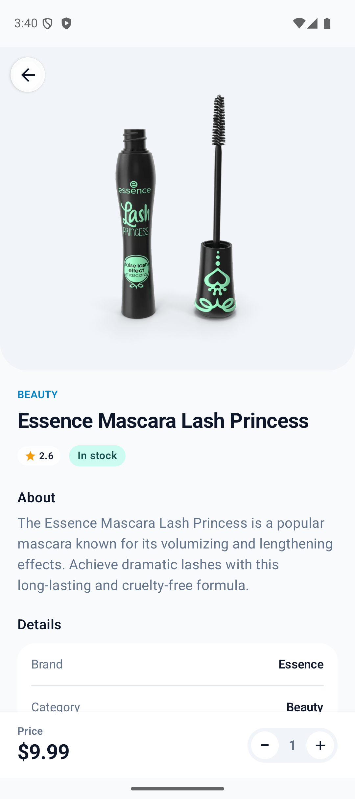
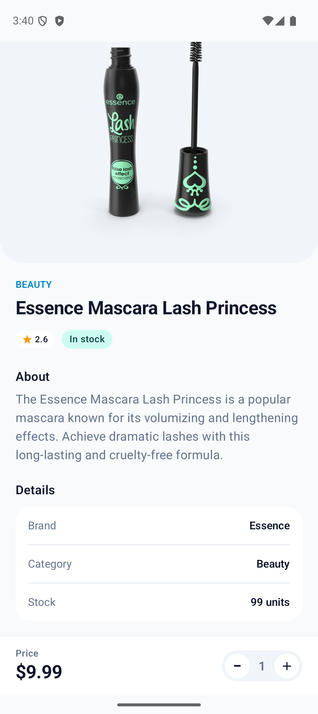
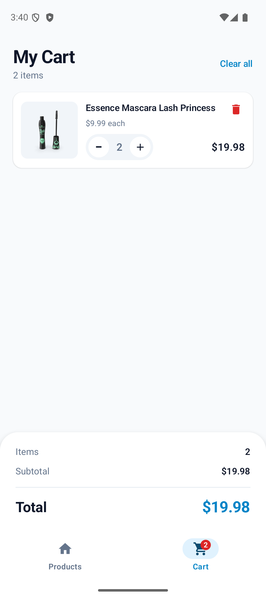
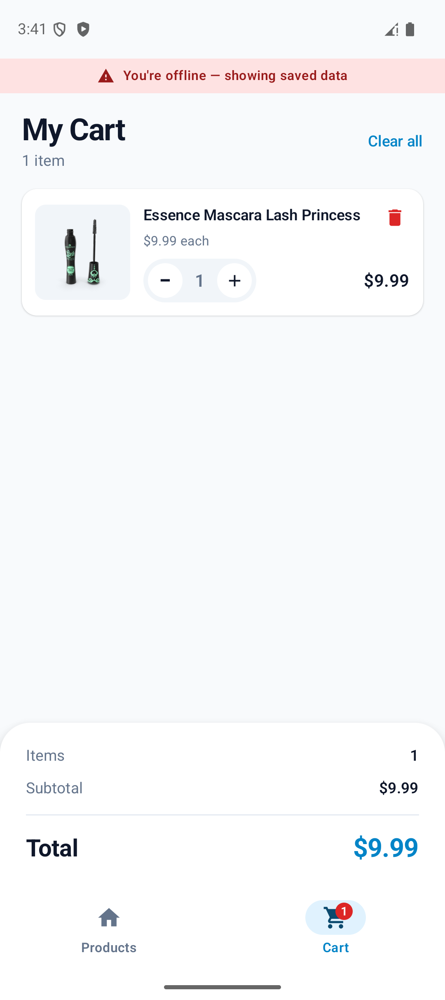

# Spire – Product Catalog & Offline Cart

Android app that fetches products from the [DummyJSON Products API](https://dummyjson.com/docs/products), lets users browse, search and filter them, view product details, and manage a **shopping cart that is persisted locally and works fully offline**.

Kotlin · Jetpack Compose · Coroutines/Flow · Retrofit/OkHttp · Room · MVVM · Koin

## Screenshots

### Product list and search
| Product list | Search results |
|---|---|
|  |  |

### Product details
| Top of screen | Brand, category, stock |
|---|---|
|  |  |

### Cart
| Cart with totals | Cart offline, after app restart |
|---|---|
|  |  |

## Features

### Product listing
- Each card shows image, name, price and rating.
- Pagination with `limit`/`skip`, loading more as the user scrolls.
- States: skeleton loading, empty list, error with a **Try again** button, pull-to-refresh.
- Category chips filter the list.

### Search
- 400 ms debounce, so the API is not hit on every keystroke.
- A new query cancels the in-flight request, so stale results never overwrite newer ones.
- "No results" is a distinct state from an error.

### Product details
- Image gallery, name, description, price, rating, category, brand and stock.
- Add to cart, with quantity stepper once the product is in the cart. Quantity is capped by stock; out-of-stock products cannot be added.

### Shopping cart
- Add, increase, decrease, remove, and clear all.
- Total item count and total price, plus a badge on the Cart tab.
- Removing the last unit asks for confirmation.
- Persisted in Room: survives closing and reopening the app.

### Offline support
- The cart works with no connection: view items, change quantities, remove items, and see item count and total price.
- Previously loaded product list and details are served from the Room cache.
- An offline banner is shown, and a failed load retries automatically when connectivity returns.

### Error handling
| Case | Behaviour |
|---|---|
| No internet | Offline banner. Cached data shown if available, otherwise error state with Try again |
| Request timeout (15 s) | Timeout error message with Try again |
| API failure (HTTP 4xx/5xx, e.g. 404) | HTTP error message with Try again |
| Malformed response | Parse error message with Try again |
| Empty search results | "No results" state |
| Empty product list / empty cart | Dedicated empty states |

## Setup

Requirements: Android Studio (recent), JDK 17+, Android SDK 37, device or emulator with API 24+. Internet is needed on first launch to fill the cache. No API key or account is needed.

```bash
git clone <repository-url>
cd SPIRE
./gradlew assembleDebug
./gradlew installDebug      # with a device/emulator connected
```

Or open the project in Android Studio and run the `app` configuration.

## Architecture

MVVM with a repository layer. Room is the single source of truth: the UI only observes Room flows, and the network only writes into Room.

```
Compose screens -> ViewModels (StateFlow) -> domain.repository (interfaces)
                                                  ^
        data.repository (impl) -> Room DAOs (Flow) -> SQLite
                      \-> DummyJsonApi (Retrofit/OkHttp) -> DTO -> Mapper -> Entity
Koin modules: network / database / repository / viewModel   (di/AppModules.kt)
```

```
core/        AppError taxonomy, apiCall wrapper, ConnectivityObserver
data/        local (Room), remote (Retrofit + DTOs), mapper, repository impls
domain/      models, repository interfaces
ui/          products, detail, cart, components, navigation, theme
```

- DTO, Entity and Domain models are separate, mapped in `Mappers.kt`.
- UI state is exposed as `StateFlow` and collected with `collectAsStateWithLifecycle`. One-shot events use a `Channel` of typed sealed events.
- Type-safe Navigation Compose routes.

## Libraries

| Purpose | Library |
|---|---|
| UI | Jetpack Compose (BOM 2026.02.01), Material 3, Navigation Compose 2.10 |
| Async | Kotlin Coroutines, Flow |
| Network | Retrofit 3, OkHttp 5, kotlinx.serialization |
| Storage | Room 2.8 (KSP), schema exported to `app/schemas` |
| Images | Coil 3 |
| DI | Koin 4 |

## Local storage

Room database `spire.db`:

| Table | Purpose |
|---|---|
| `products` | Cached products (list and detail data) |
| `feed_items` | Ordered feed per key (all / search / category), composite key `(feedKey, position)` |
| `categories` | Cached category chips |
| `cart_items` | Cart rows |

Money is stored as integer cents (`priceCents`), converted from the API's decimal once in `Mappers.kt`. Schema v2 added this; `MIGRATION_1_2` rebuilds the tables and keeps cart rows, so an existing cart survives the upgrade. There is no destructive-migration fallback.

## Design decisions

- **Cart row is a snapshot.** `cart_items` stores title, price, thumbnail and stock at add time, so the cart renders with no network and no product cache.
- **Race-safe cart.** `addOrIncrement` and `decrementOrRemove` are `@Transaction`. Increment is guarded by `quantity < stock` in SQL. Totals come from SQL sums and update reactively.
- **`feed_items` position table.** Page writes are idempotent, so retrying a page cannot duplicate items.
- **Offline search fallback.** If the search request fails and nothing is cached for the query, a local `LIKE` search runs over cached products.
- **Search cancels stale work.** Debounce, `distinctUntilChanged`, and the in-flight load job is cancelled on a new query.
- **Money in cents.** `Long` cents end to end, so line totals and the grand total never disagree by a cent.
- **Framework-free domain.** `AppError` has no Retrofit/serialization imports. Transport errors are mapped in `data/remote/ApiCall.kt`. ViewModels emit typed events (`ListEvent`, `DetailEvent`), and screens turn them into localized text.
- **Process-death safe UI state.** Search query and category live in `SavedStateHandle`. Confirm dialogs use `rememberSaveable`.
- **Confirm dialogs** on add and remove, to avoid accidental taps.

## Known limitations

- Cart price and stock are a snapshot taken at add time. A later price change or restock is not reflected until the item is re-added.
- Search cannot be combined with a category filter: the API has no combined endpoint, so a query overrides the category.
- Images never viewed online show blank offline (Coil default cache).
- English only. Strings are in resources and ready for translation, but no other locale is shipped.
- No checkout or accounts. DummyJSON is read-only, so nothing is sent to a server.
- No automated tests are included.
